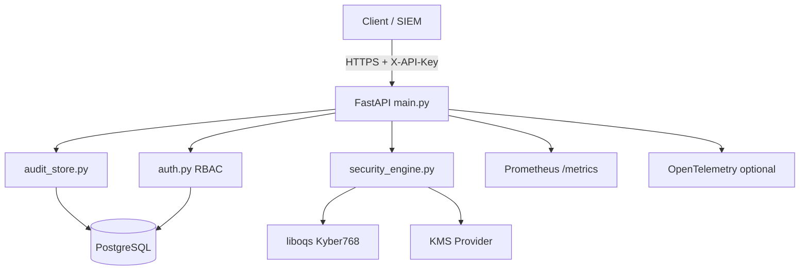

# Architecture

## Components

| Module | Responsibility |
|--------|----------------|
| `main.py` | HTTP API, middleware, OpenAPI |
| `security_engine.py` | PQC hybrid crypto + audit HMAC |
| `auth.py` | API key → role (SHA-256 lookup) |
| `audit_store.py` | Append-only audit persistence + hash-chain prep |
| `database.py` | Async SQLAlchemy engine / pool |
| `models.py` | `ApiKey`, `AuditLog` |
| `providers/kms/` | AWS / Vault / Azure stubs |
| `observability.py` | Logs, correlation ID, metrics, OTEL |

## Data Flow — Seal

1. Client sends public key + plaintext (Base64) + `context` (AAD).
2. API validates RBAC and payload size.
3. `SecurityEngine.encrypt_hybrid`: Kyber encapsulation → AES-GCM.
4. Signed audit entry appended via `store_log`.
5. Ciphertext components returned (client holds private key).

## Deployment

- **Docker Compose**: `postgres` + `quantum-shield-api`
- **Scaling**: horizontal replicas behind reverse proxy; shared PostgreSQL
- **Secrets**: `.env` / Vault / K8s secrets — never in image layers
