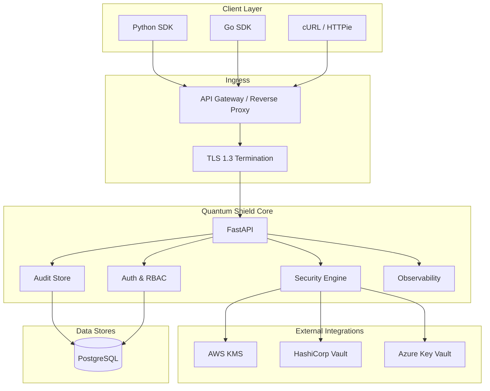
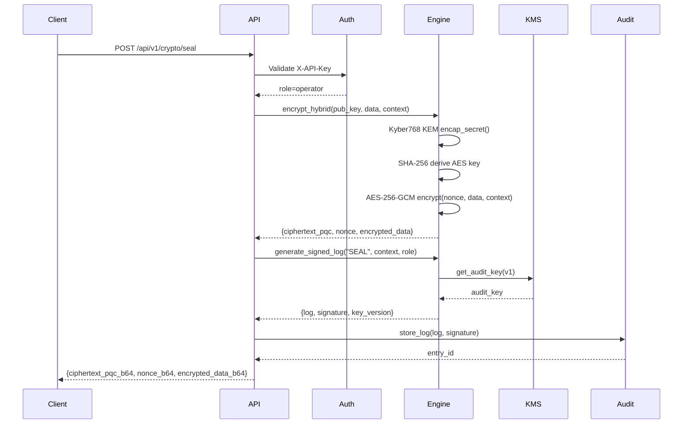
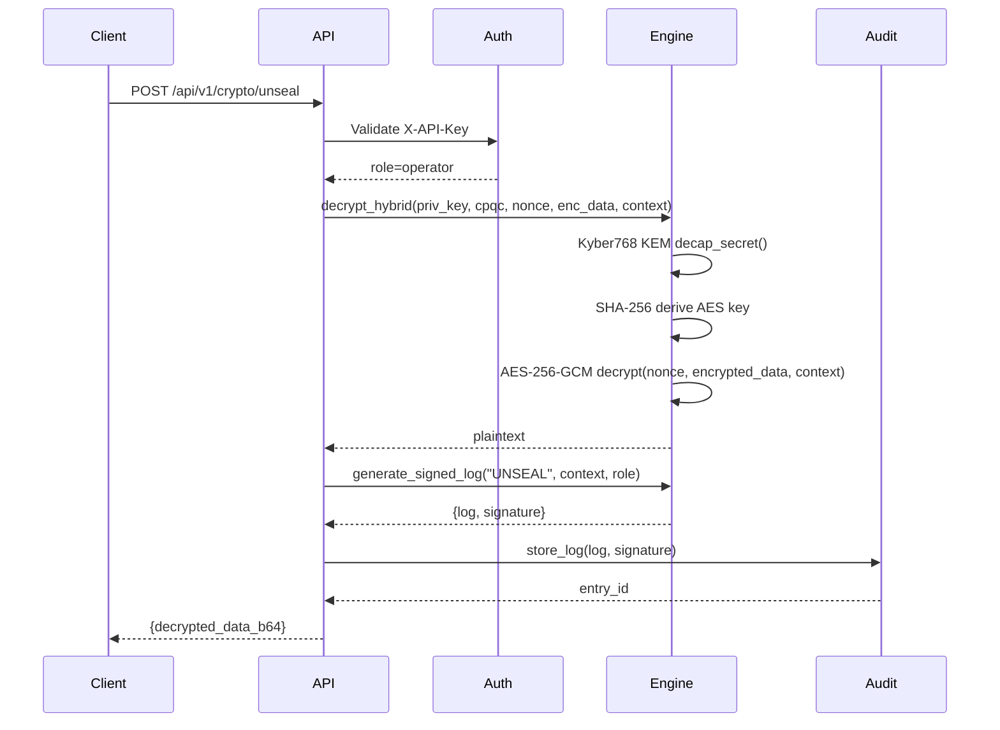
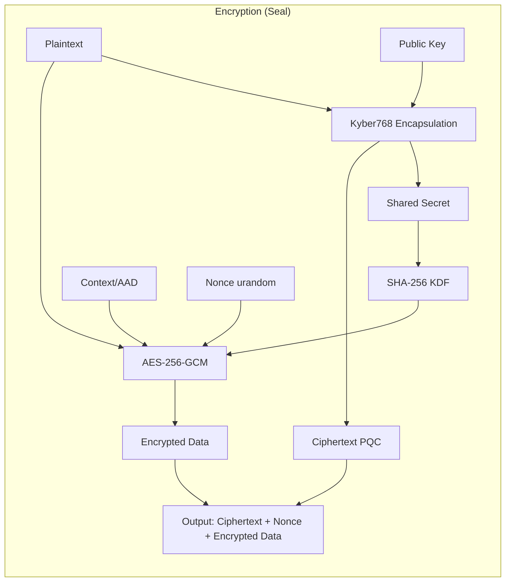
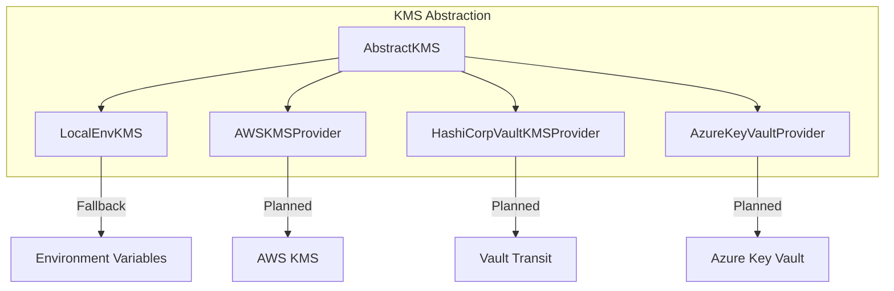

# Architecture — Quantum Shield Core

## System Diagram

## Data Flow: Seal Operation

## Data Flow: Unseal Operation

## Cryptographic Flow

## Component Stack

| Layer | Technology | Responsibility |
|-------|-----------|----------------|
| API | FastAPI (Python 3.12+) | HTTP endpoints, validation, routing |
| Auth | SQLAlchemy + SHA-256 | API key hashing, RBAC enforcement |
| Crypto (KEM) | liboqs-python (Python) | ML-KEM-768 key generation and KEM |
| Crypto (AEAD) | pyca/cryptography (Python) | AES-256-GCM with AAD |
| Crypto (Rust) | PyO3 (Rust) | HMAC-SHA256 audit, AES-GCM operations |
| Audit | PostgreSQL + SQLAlchemy | Append-only log persistence |
| Logging | structlog / JSON | Structured JSON for SIEM |
| Metrics | Prometheus | `/metrics`, crypto ops counters |
| Tracing | OpenTelemetry | W3C trace context, OTLP export |
| Rate Limiting | slowapi | Per-IP rate limiting |
| Container | Docker + K8s | Deployment, scaling, health checks |

## KMS Integration Points

## Resource Requirements

| Environment | CPU | RAM | Storage | Notes |
|-------------|-----|-----|---------|-------|
| Development | 1 vCPU | 512 MB | 100 MB | SQLite, no KMS |
| Production | 2 vCPU | 2 GB | 10 GB + DB | PostgreSQL, KMS |
| High-availability | 4 vCPU | 4 GB | 50 GB + DB | 3 replicas, HPA |